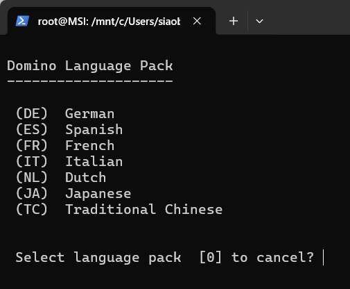

# domino-container-lp-recipe

> Community tool to integrate **Language Packs** (Traditional Chinese, Simplified Chinese, Korean, …) into HCL Domino container builds.
>
> 社群工具，幫你把**多國語言 Language Pack**（繁中、簡中、韓文…）整合到 HCL Domino container build 流程。

[](LICENSE)
[](https://github.com/HCL-TECH-SOFTWARE/domino-container)
[](https://github.com/HCL-TECH-SOFTWARE/domino-container/issues/55)

---

## English

### What this is

A small CLI tool that patches an upstream `HCL-TECH-SOFTWARE/domino-container` clone to add support for languages that aren't in the original 6 (DE/ES/FR/IT/NL/JA). The patches are surgical (4 anchored edits in `build.sh`, 1 in `install_domino.sh`, 2 in `software.txt`), so they apply cleanly and you can audit them in 5 minutes.

This is **a recipe, not a fork**: you `git clone` upstream fresh and run our script. When upstream changes, you just re-run. If upstream has touched the lines our patches target, the script halts and prints exactly what's wrong — something like `expected 2 matches in build.sh, found 0`. Follow [`upgrade-guide.md`](upgrade-guide.md) to adjust the anchor strings in `patch.py` (a small edit, not a fork-wide rebase). No long-running fork drift.

→ Why a recipe and not a fork? See [`docs/why-recipe-not-fork.md`](docs/why-recipe-not-fork.md).

### Status of supported languages

Languages live in [`language_registry.py`](language_registry.py). Each has a status:

| Status | Meaning | Use with `apply-lp.sh`? |
|---|---|---|
| `verified` | Installer code confirmed via `strings LNXDomLP \| grep LangCodeList`, and a successful end-to-end build by the recipe author or contributor. | ✅ Yes |
| `inferred` | Installer code inferred from symmetric reasoning (e.g. SC `zh-CN` by analogy with TC `zh-TW`). Not yet tested. | ⚠️ Requires `--allow-inferred` |
| `template` | Skeleton entry; installer code is `None` and must be verified by you. | ❌ No, fill the registry first |

Current registry:

| Code | Status | Notes |
|---|---|---|
| **TC** | ✅ verified | Traditional Chinese, reference implementation |
| SC | ⚠️ inferred | Simplified Chinese (sc → zh-CN by symmetry) |
| KO | 📝 template | Korean (needs `strings LNXDomLP` to find installer code) |

### Quick start — Traditional Chinese (verified)

```bash
# 1. Clone this recipe
git clone https://github.com/bryanHsiao/domino-container-lp-recipe.git ~/lp-recipe

# 2. Run apply-lp.sh
#    Clones upstream domino-container, checks out the tested commit, patches it for TC.
~/lp-recipe/apply-lp.sh --lang TC

# 3. Place LP tar in /local/software/
#    (download from HCL FlexNet; not redistributable, so not bundled here)

# 4. Build
cd /local/github/domino-container
./build.sh domino 14.5.1 -restapi=1.1.7 -leap=1.1.10 -domlp=TC

# 5. Verify
~/lp-recipe/verify.sh --lang TC
```

After `apply-lp.sh --lang TC`, re-launching `./build.sh menu` and pressing `L` shows `(TC) Traditional Chinese` as a 7th option alongside the original six (press `t` to select):



### Adding a new language (KO / SC / TH / …)

Full walkthrough: [`docs/adding-new-language.md`](docs/adding-new-language.md). Summary:

1. Extract the LP tar and run `strings LNXDomLP | grep LangCodeList` to find the language's internal code.
2. Add an entry to `language_registry.py` with `status="verified"` (or `"inferred"` if you don't have a tar to test yet).
3. Run `./apply-lp.sh --lang <CODE>` and build.
4. If it works, send a PR back to this repo upgrading the status to `verified` — others benefit.

### ⚠️ Important: existing `/local/notesdata` won't pick up new LP

If you've already done OneTouch Setup on this server, rebuilding with this recipe **won't make existing databases Chinese / Korean / etc.** Domino container's entrypoint detects `Data already installed for 14050100` and skips template deployment. You need either a fresh data dir + new OneTouch Setup, or manual Replace Design on each `.nsf`.

Detailed discussion in [`docs/sync-trap-caveat.md`](docs/sync-trap-caveat.md). **Read this before rebuilding an already-running server.**

### License

Apache-2.0 (same as upstream).

This recipe **contains no HCL software**. You bring your own LP tars from HCL FlexNet under your own license.

### Related projects

- **Upstream**: [`HCL-TECH-SOFTWARE/domino-container`](https://github.com/HCL-TECH-SOFTWARE/domino-container)
- **Background issue**: [HCL Issue #55](https://github.com/HCL-TECH-SOFTWARE/domino-container/issues/55)

---

## 繁體中文

### 這是什麼

一個小型命令列工具，對 `HCL-TECH-SOFTWARE/domino-container` 上游程式碼套用修補，讓它支援預設 6 種（DE/ES/FR/IT/NL/JA）以外的語言。修補範圍很小（`build.sh` 4 處、`install_domino.sh` 1 處、兩份 `software.txt`），5 分鐘就能讀完審完。

本工具走「**動態修補**」路線而不是「**fork**」：你從上游 clone 一份乾淨的程式碼，再跑本工具的腳本。上游有改動時你重跑就好；如果上游改到我們修補的位置、修補套不上去，腳本會明確印出「在 `build.sh` 預期找到 2 個、實際找到 0 個」這類錯誤訊息，照 [`upgrade-guide.md`](upgrade-guide.md) 微調 `patch.py` 內的字串即可（小改，不用維護整個 fork）。**不用長期跟上游同步**。

→ 為什麼用工具修補而不是維護 fork？見 [`docs/why-recipe-not-fork.md`](docs/why-recipe-not-fork.md)。

### 已支援語言的狀態

語言定義在 [`language_registry.py`](language_registry.py)。每個語言有一個狀態：

| 狀態 | 意義 | 能用 `apply-lp.sh` 套用嗎？ |
|---|---|---|
| `verified` | `installer_code` 已透過 `strings LNXDomLP \| grep LangCodeList` 驗證，且作者或貢獻者已成功 build 過。 | ✅ 可以 |
| `inferred` | `installer_code` 從對稱推論而來（例如 SC 的 `zh-CN` 對應 TC 的 `zh-TW`）。**未實測**。 | ⚠️ 需加 `--allow-inferred` |
| `template` | 範本條目；`installer_code` 為 `None`，你要先補上才能用。 | ❌ 不行，先填語言註冊表 |

目前註冊表內容：

| 代號 | 狀態 | 備註 |
|---|---|---|
| **TC** | ✅ verified | 繁體中文，參考實作 |
| SC | ⚠️ inferred | 簡體中文（從 TC 對稱推論出 `sc → zh-CN`）|
| KO | 📝 template | 韓文（需用 `strings LNXDomLP` 找出語言內部碼）|

### 快速開始 — 繁體中文（已驗證）

```bash
# 1. clone 本工具
git clone https://github.com/bryanHsiao/domino-container-lp-recipe.git ~/lp-recipe

# 2. 跑 apply-lp.sh
#    自動 clone 上游 domino-container、checkout 到測試過的 commit、對 TC 套用修補
~/lp-recipe/apply-lp.sh --lang TC

# 3. 把 LP tar 檔放到 /local/software/
#    （從 HCL FlexNet 下載；HCL 軟體不能重新散布，所以不在本 repo 內）

# 4. Build
cd /local/github/domino-container
./build.sh domino 14.5.1 -restapi=1.1.7 -leap=1.1.10 -domlp=TC

# 5. 驗證
~/lp-recipe/verify.sh --lang TC
```

跑完 `apply-lp.sh --lang TC` 後，重新進入 `./build.sh menu` 按 `L`，LP 子選單就會在原本 6 種（DE/ES/FR/IT/NL/JA）之後多出 `(TC) Traditional Chinese` 第 7 個選項，按 `t` 即可選用：


### 加新語言（KO / SC / TH 等）

完整教學見 [`docs/adding-new-language.md`](docs/adding-new-language.md)。重點：

1. 解壓 LP tar 檔，跑 `strings LNXDomLP | grep LangCodeList` 找該語言的內部碼。
2. 在 `language_registry.py` 加一筆條目，狀態標 `"verified"`（若沒 tar 可測就標 `"inferred"`）。
3. 跑 `./apply-lp.sh --lang <代號>` 然後 build。
4. 跑通後請發 PR 回來把狀態升級為 `verified`，造福其他人。

### ⚠️ 重要：已存在的 `/local/notesdata` 不會自動套用新 LP

如果你已經對這台 server 做過 OneTouch Setup，**重新 build 不會讓既有 .nsf 變繁中／韓文／其他語言**。Domino container 的進入點偵測到 `Data already installed for 14050100` 就會跳過範本部署。

解法：清空資料目錄重做 OneTouch Setup，或對每個既有 `.nsf` 手動執行 Replace Design。

詳細討論見 [`docs/sync-trap-caveat.md`](docs/sync-trap-caveat.md)。**對已運行的 server 重 build 之前請讀**。

### 授權

Apache-2.0，與上游一致。

本工具**不含任何 HCL 軟體**。LP tar 檔請依你自己的授權，從 HCL FlexNet 下載。

### 相關專案

- **上游**：[`HCL-TECH-SOFTWARE/domino-container`](https://github.com/HCL-TECH-SOFTWARE/domino-container)
- **背景 issue**：[HCL Issue #55](https://github.com/HCL-TECH-SOFTWARE/domino-container/issues/55)
